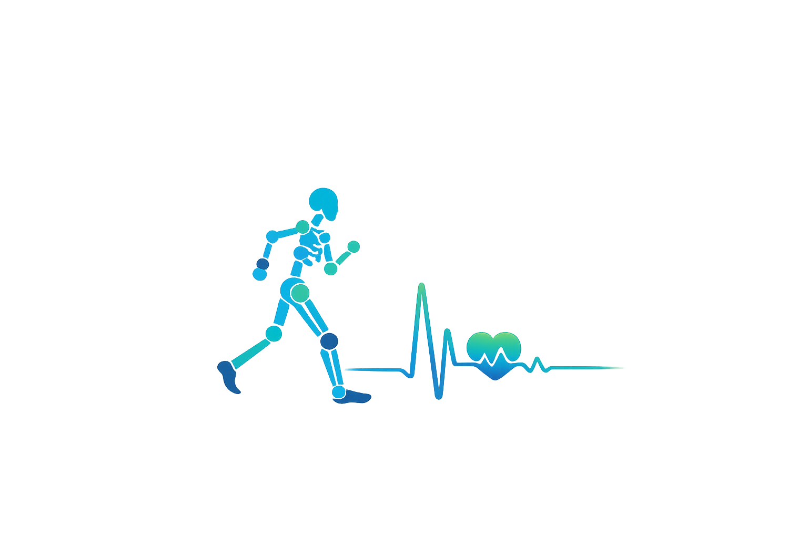

<p align="center">
  
</p>

<h1 align="center">Biomechanics 4 All</h1>

<p align="center">
  Markerless Clinical Gait Analysis and Interactive Finetuning
</p>

<p align="center">
  
  
  
</p>

---

## Overview
Biomechanics 4 All is a markerless clinical gait analysis platform designed to support biomechanical motion assessment and interactive motion finetuning.
The system processes motion videos, extracts biomechanical movement data, and provides tools for improving analysis quality and workflow efficiency in healthcare and research environments.

## Features
- Markerless motion capture from video
- Clinical gait analysis workflow
- Interactive motion finetuning
- Human pose estimation pipeline
- Designed for healthcare and research applications

## Tech Stack

- Python 3.11.9
- FastAPI
- WHAM

## Setup
### Backend
- Python 3.11.9

### 1. Update the repository

```
git pull origin dev
```
or 
```
git pull origin main
```

Navigate into the backend folder:
```
cd backend
```

### 2. Create virtual environment

**Windows**

```
python -m venv venv
venv\Scripts\activate
```

**Linux / macOS**

```
python3 -m venv venv
source venv/bin/activate
```

---

### 3. Install dependencies

```
python -m pip install -r requirements.txt
```

---

### 4. Start the backend server

**Local machine**
```
python -m uvicorn main:app --reload
```
**Local network**
```
python -m uvicorn main:app --host 0.0.0.0 --port 8000 --reload
```

---

### 5. Open API documentation

```
http://127.0.0.1:8000/docs
```
## Vision
Biomechanics 4 All aims to provide an open-source markerless motion analysis solution for clinical and research applications.

## Team
Biomechanics 4 All  
AAI2 Motion Capture Project 2026

- Boris Kodzhabashev
- Maximilian Barry
- Michael Zeller
- Niklas Hofstetter
- Selina Hacker

## License

This project is licensed under the Apache License 2.0.
